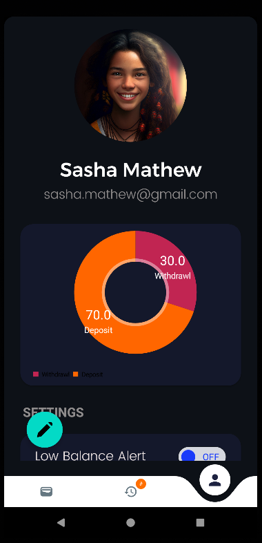

# CashPI

> [!NOTE]
> Still on Work.

 

CashPI🚀: Empower your financial journey with seamless expense tracking and deposit management. Built on MVVM architecture and CURD operations, it's your smart cash caretaker for effective money control.

 

### Architecture

	

MVVM (Model-View-ViewModel) is a software architectural pattern for developing user interfaces. It separates the application into three components: Model (data and business logic), View (UI elements), and ViewModel (mediator between Model and View), enhancing code modularity and testability in modern software development.

### Screenshots 

<table>

<tr>
<td>

	

</td>
<td>

	

</td>
<td>

	

</td>
<td>

	

</td>
</tr>
</table>
